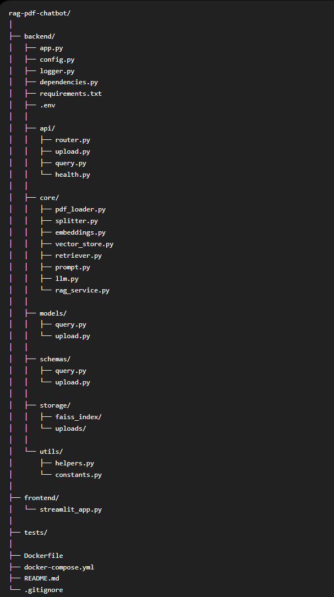
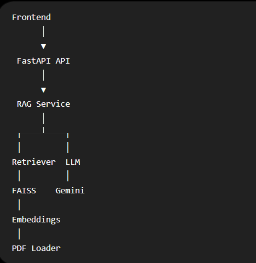
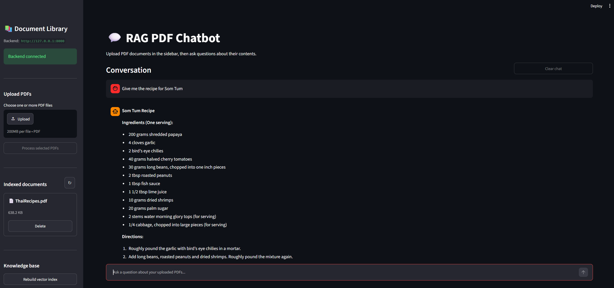
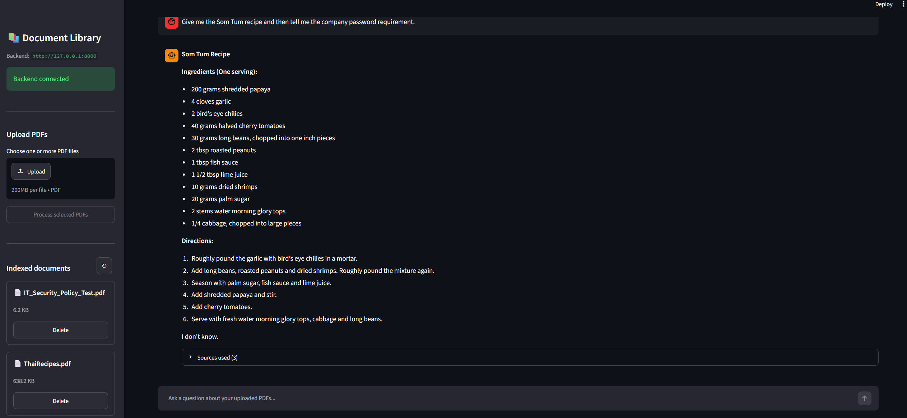

# RAG PDF Chatbot

Production-ready Retrieval Augmented Generation application.

## Stack

- FastAPI
- Streamlit
- LangChain
- Google Gemini
- FAISS
- PyMuPDF

### Project Structure



### This modular design makes the application easier to test, maintain, and extend.



The FastAPI API layer will have:

- Upload PDF endpoint
- Query endpoint
- Health endpoint
- Request/response Pydantic models
- File validation
- Automatic PDF processing after upload
- Proper error handling
- OpenAPI documentation

Now, l have a fully working backend that can ingest PDFs and answer questions through REST APIs.

### Production Backend Refactor

I improved the architecture without changing the external API.

- Dependency Injection for all services
- Application lifespan management
- Multiple PDF support
- Conversation memory
- Source citations
- Streaming responses
- Central service registry
- Better metadata handling
- Automatic loading of the FAISS index at startup

This will keep the Streamlit code very simple because the backend will do all the heavy lifting.

```
uvicorn backend.app:app --reload
```

### On the second terminal run this command:
```
streamlit run frontend/streamlit_app.py
```

### Test order
**Use this sequence:**

1. Confirm the sidebar says Backend connected.
2. Upload one PDF.
3. Confirm it appears under Indexed documents.
4. Ask a question whose answer exists in the PDF.
5. Expand Sources used beneath the answer.
6. Upload a second PDF.
7. Ask a question about the second PDF.
8. Delete one PDF and verify the index rebuilds.
9. Test Clear chat without deleting documents.
10. Test Clear all documents only after the other operations work.





### Build and run

Stop your locally running FastAPI and Streamlit processes first so ports 8000 and 8501 are free.

From the project root:

```
docker compose up -d
```
### Open:
```
Streamlit app:
http://localhost:8501/

FastAPI documentation:
http://localhost:8000/docs
```

### To run in the background:
```
docker compose up -d --build
```
### View logs
```
docker compose logs -f
```
### Stop the application:
```
docker compose down
```
